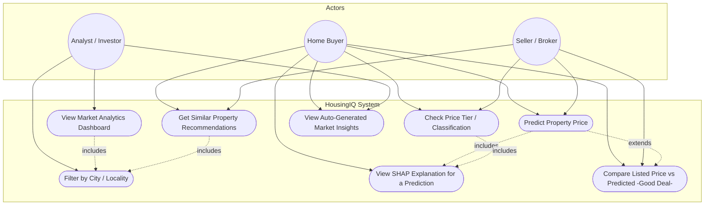
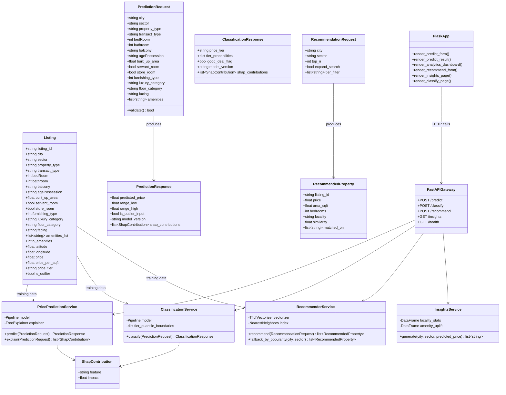
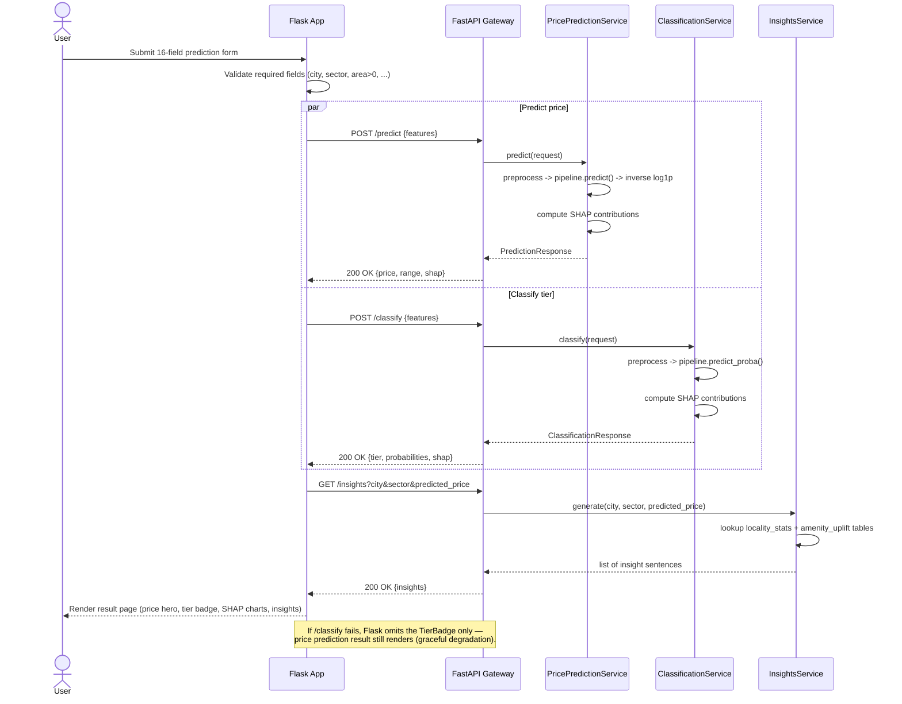
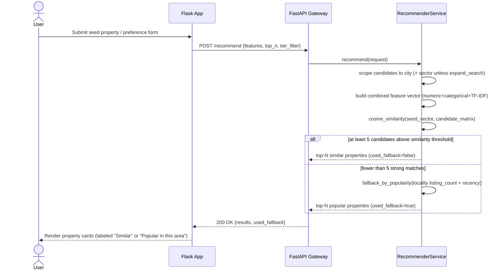
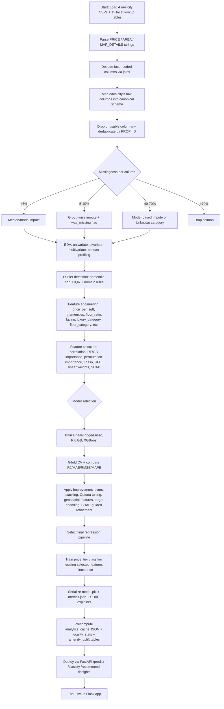
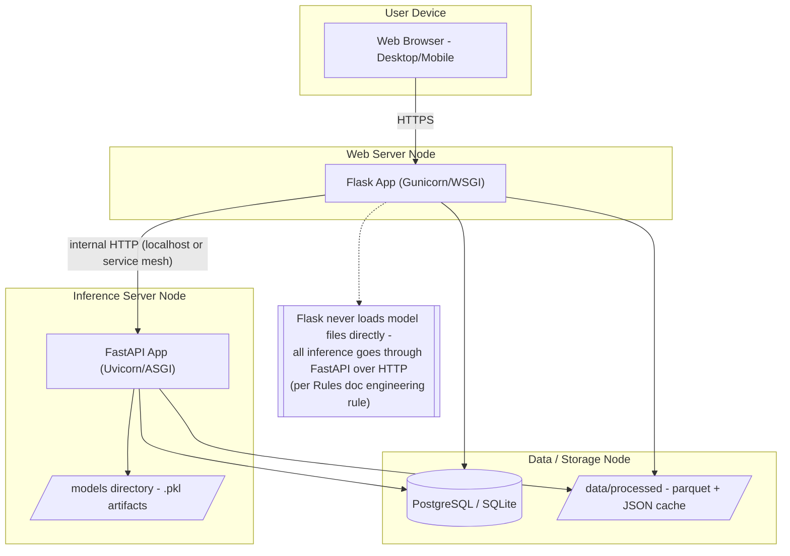
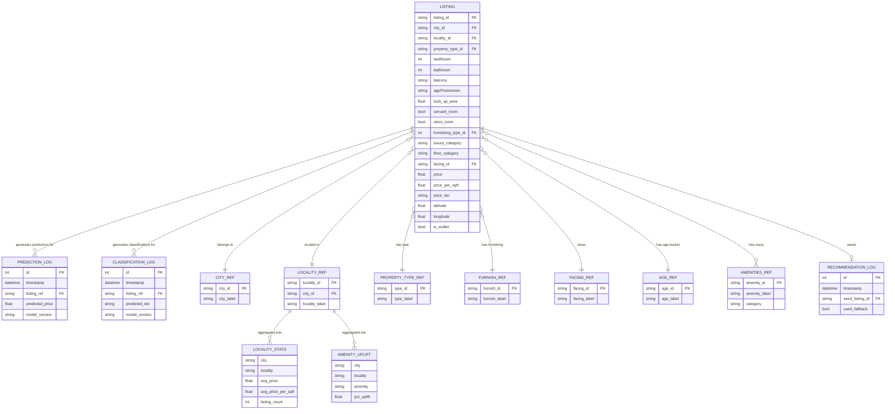
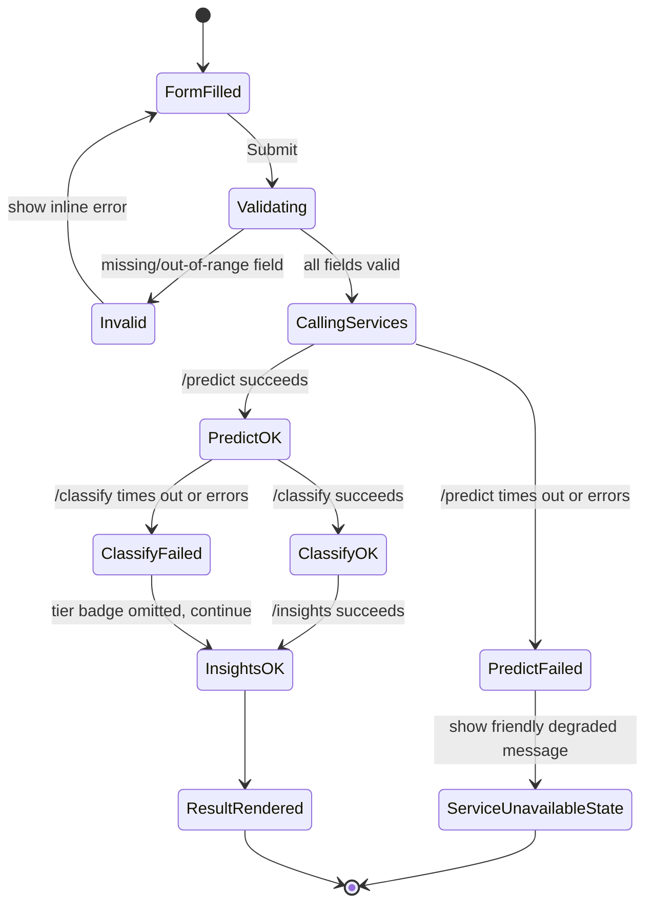

# UML Diagrams — HousingIQ Platform

All diagrams use Mermaid syntax (renders directly in GitHub, VS Code, Claude, and most modern markdown viewers). They reflect the finalized 16-field input schema (`10_FINALIZED_INPUT_SCHEMA.md`), the 5 modules (Price Prediction, Analytics, Recommender, Insights, Classification), and the Flask + FastAPI architecture from the TRD.

---

## 1. Use Case Diagram



---

## 2. Class Diagram (domain + ML serving layer)



---

## 3. Sequence Diagram — Price Prediction (+ parallel Classification call)



---

## 4. Sequence Diagram — Recommender System (with cold-start fallback)



---

## 5. Activity Diagram — Offline ML Pipeline (Data → Deployed Model)



---

## 6. Component Diagram

```mermaid
flowchart LR
    subgraph Client["Client (Browser)"]
        UI[HTML/CSS/JS Templates + Chart.js/Leaflet]
    end

    subgraph FlaskLayer["Flask Application (Web/UI Layer)"]
        Routes[Route Handlers: /predict /analytics /recommend /insights /classify]
        Templates[Jinja2 Templates]
        StaticAssets[Static CSS/JS]
    end

    subgraph FastAPILayer["FastAPI Service (Inference Layer)"]
        PredictRoute["/predict"]
        ClassifyRoute["/classify"]
        RecommendRoute["/recommend"]
        InsightsRoute["/insights"]
        HealthRoute["/health"]
    end

    subgraph MLArtifacts["Model Artifacts Store"]
        PriceModel[(price_model_v{n}.pkl)]
        TierModel[(tier_classifier_v{n}.pkl)]
        TfidfIdx[(tfidf_vectorizer + NN index)]
        ShapExp[(SHAP explainers)]
    end

    subgraph DataStore["Data Store"]
        CleanData[(clean_listings.parquet)]
        AnalyticsCache[(analytics_cache/*.json)]
        AggTables[(locality_stats, amenity_uplift, etc.)]
        AppDB[(SQLite/Postgres: prediction_log, classification_log, recommendation_log)]
    end

    UI --> Routes
    Routes --> Templates
    Routes -->|HTTP JSON| PredictRoute
    Routes -->|HTTP JSON| ClassifyRoute
    Routes -->|HTTP JSON| RecommendRoute
    Routes -->|HTTP JSON| InsightsRoute
    Routes -->|liveness check| HealthRoute

    PredictRoute --> PriceModel
    PredictRoute --> ShapExp
    ClassifyRoute --> TierModel
    ClassifyRoute --> ShapExp
    RecommendRoute --> TfidfIdx
    InsightsRoute --> AggTables

    PriceModel -.trained from.-> CleanData
    TierModel -.trained from.-> CleanData
    TfidfIdx -.trained from.-> CleanData
    Routes --> AnalyticsCache
    PredictRoute --> AppDB
    ClassifyRoute --> AppDB
    RecommendRoute --> AppDB
```

---

## 7. Deployment Diagram



---

## 8. Entity-Relationship (Data Model) Diagram



---

## 9. State Diagram — A Single Prediction Request's Lifecycle



---

*All diagrams are kept consistent with the 16-field input schema (`10_FINALIZED_INPUT_SCHEMA.md`), the 5-module scope (Price Prediction, Analytics, Recommender, Insights, Classification), and the Flask+FastAPI architecture defined across the TRD, App Flow, and Backend Schema updates below.*